# XLR Xray plugin

[![Build Status][xlr-xray-plugin-travis-image]][xlr-xray-plugin-travis-url]
[![Codacy Badge][xlr-xray-plugin-codacy-image] ][xlr-xray-plugin-codacy-url]
[![Code Climate][xlr-xray-plugin-code-climate-image] ][xlr-xray-plugin-code-climate-url]
[![License: MIT][xlr-xray-plugin-license-image] ][xlr-xray-plugin-license-url]
[![Github All Releases][xlr-xray-plugin-downloads-image] ]()

[xlr-xray-plugin-travis-image]: https://travis-ci.org/xebialabs-community/xlr-xray-plugin.svg?branch=master
[xlr-xray-plugin-travis-url]: https://travis-ci.org/xebialabs-community/xlr-xray-plugin
[xlr-xray-plugin-codacy-image]: https://api.codacy.com/project/badge/Grade/0e664aaacd2f4010b091f0ef4ce1c7d0
[xlr-xray-plugin-codacy-url]: https://www.codacy.com/app/amitmohleji/xlr-xray-plugin
[xlr-xray-plugin-code-climate-image]: https://codeclimate.com/github/xebialabs-community/xlr-xray-plugin/badges/gpa.svg
[xlr-xray-plugin-code-climate-url]: https://codeclimate.com/github/xebialabs-community/xlr-xray-plugin
[xlr-xray-plugin-license-image]: https://img.shields.io/badge/License-MIT-yellow.svg
[xlr-xray-plugin-license-url]: https://opensource.org/licenses/MIT
[xlr-xray-plugin-downloads-image]: https://img.shields.io/github/downloads/xebialabs-community/xlr-xray-plugin/total.svg

This plugin offers an interface from XL Release to Atlassian Stash (now Xray Server) and Xray Cloud API.

#### IMPORTANT ####

* Use **Stash Connection and Stash Tasks** if you're using an **on-prem hosted Xray Server**. Stash is now called Xray Server.  
* Use **Xray Connection and Xray Tasks** if you're using **Xray Cloud**.
* All Stash/Xray Server tasks are based on api **/rest/api/1.0/** prefix.
* All Xray Cloud tasks are based on api **/2.0/** prefix.


# Development #

* Start XLR: `./gradlew runDockerCompose`

# Type definitions #

### Commit Pull Triggers ###

+ `xray.CommitTrigger` : This trigger can be used to poll Xray cloud for triggering releases on code commit.
+ `stash.CommitTrigger` :  This trigger can be used to poll Stash for triggering releases on code commit.

### Webhook (Push) ###

+ **Stash Push Webhook** `http://<xlr server:port>/api/extension/stash/push_webhook?template=<template name>` : This can be used to push Commit notifications across branches in a repository. Requires [Web POST Hooks Plugin](https://marketplace.atlassian.com/plugins/com.atlassian.stash.plugin.stash-web-post-receive-hooks-plugin/server/overview).
+ **Stash Pull Request Webhook** `http://<xlr server:port>/api/extension/stash/pr_webhook?template=<template name>` : This can be used to push Pull Request notifications. Requires [Pull Request Notifier Plugin](https://marketplace.atlassian.com/plugins/se.bjurr.prnfs.pull-request-notifier-for-stash/server/overview).
+ **Xray Push Webhook** `http://<xlr server:port>/api/extension/xray/push_webhook?template=<template name>` : This can be used to push Commit notifications across branches in a repository.

### Xray Tasks ###

+ `xray.CreatePullRequest` : This task helps to create a pull request.
+ `xray.MergePullRequest` : This task helps to Merge a pull request.
+ `xray.WaitForMerge` : This task waits and polls xray to check the status of a Pull request Merge Status.
+ `xray.DownloadCode` : This task allows to export a code zip file that can be downloaded to a specified folder on XL Release server locally for a provided branch in repository.

### Stash Tasks ###    

+ `stash.CreatePullRequest` : This task helps to create a pull request.
+ `stash.MergePullRequest` : This task helps to Merge a pull request.
+ `stash.DeclinePullRequest` : This task can be used to Decline a pull request.
+ `stash.WaitForMerge` : This task waits and polls stash to check the status of a Pull request Merge Status.
+ `stash.DownloadCode` : This task allows to export a code zip file that can be downloaded to a specified folder on XL Release server locally for a provided branch in repository. Requires [Xray Server Archive plugin](https://marketplace.atlassian.com/plugins/com.atlassian.stash.plugin.stash-archive/server/overview).
+ `stash.searchFileContent` : This task allows to search a file's content in a repository/branch using a provided pattern and return group0 and group1 as results. E.g.,

	```
	version[ ]*=[ ]*(\d+)
	```

+ `stash.DeleteBranch` : This task allows to delete a branch.
+ `stash.TagRelease` : This task adds a tag to a branch.


# Commit Trigger Usage #

* Stash commit trigger configuration
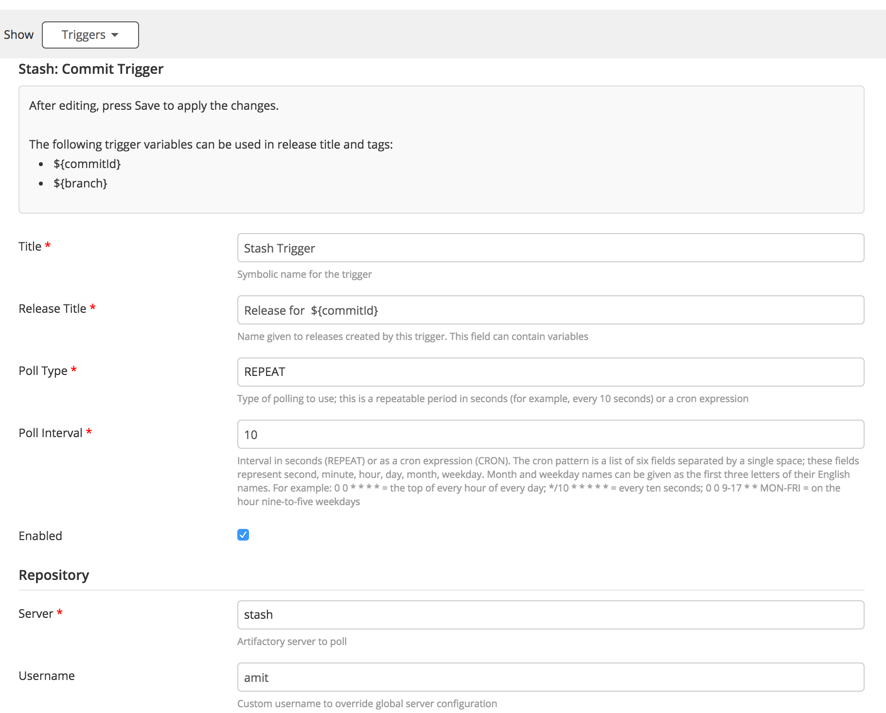
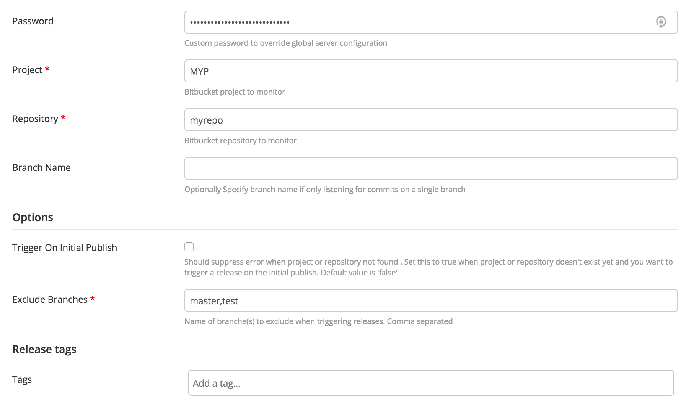

# Xray Tasks Usage #

* Setup the server configuration


* Create pull request


* Merge pull request


* Wait for merge


* Download Code


# Stash Tasks Usage #


* Setup the server configuration
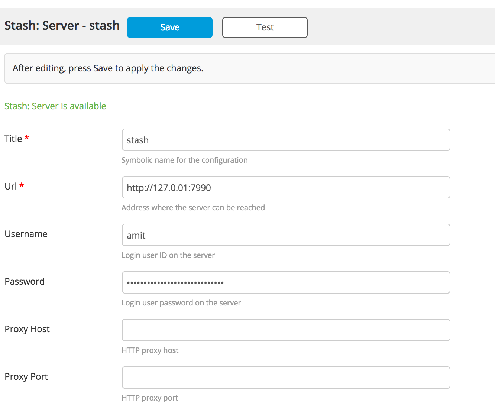

* Create pull request
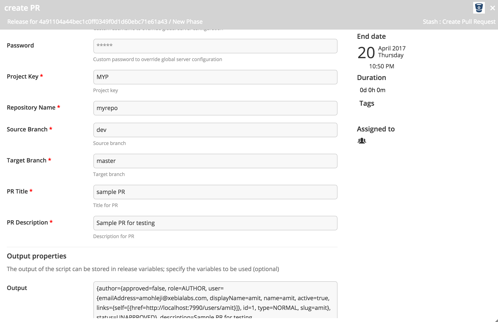

* Merge pull request
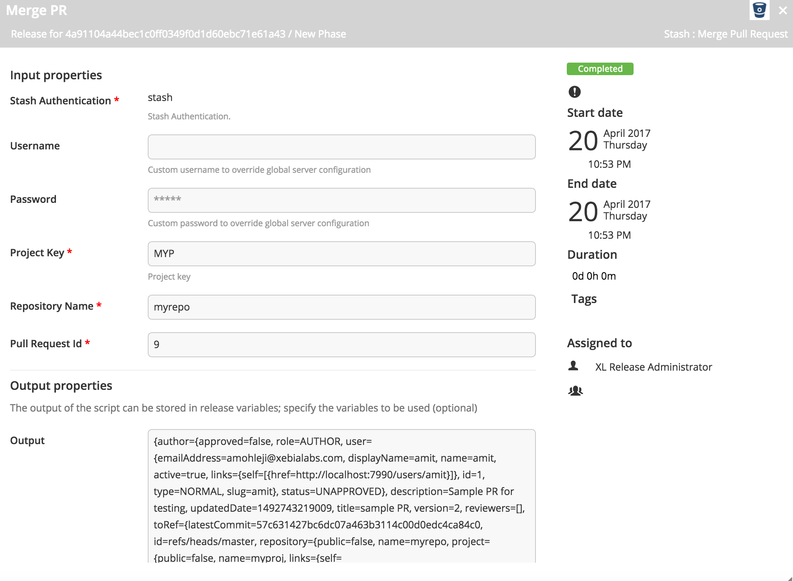

* Wait for merge
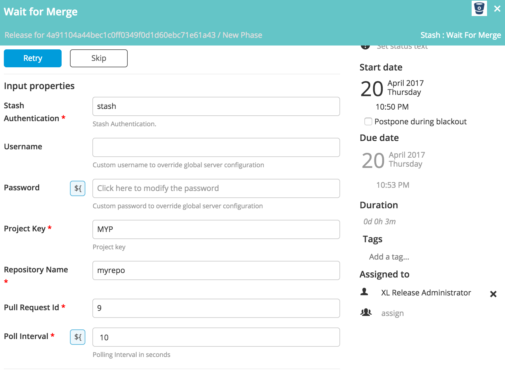

* Decline pull request
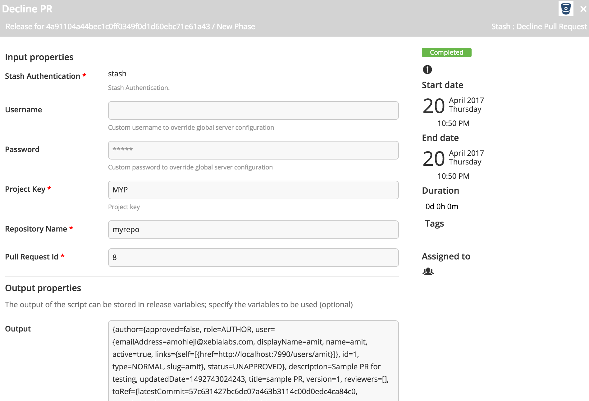

* Delete branch
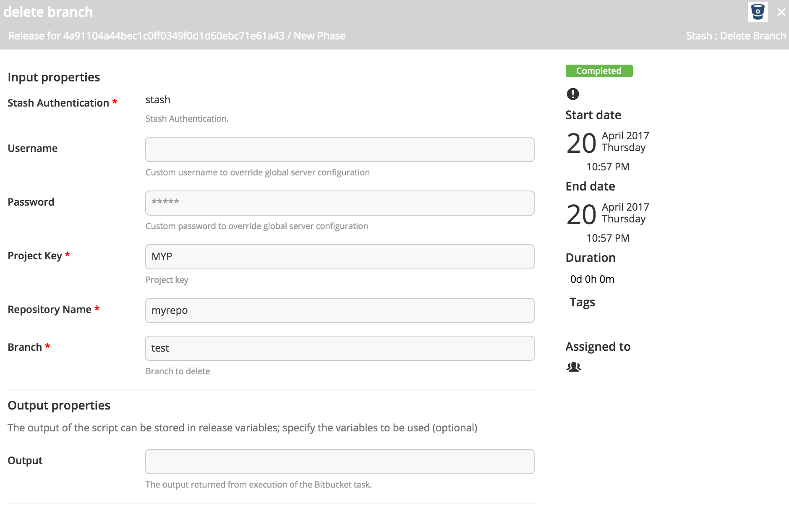

* Search file content
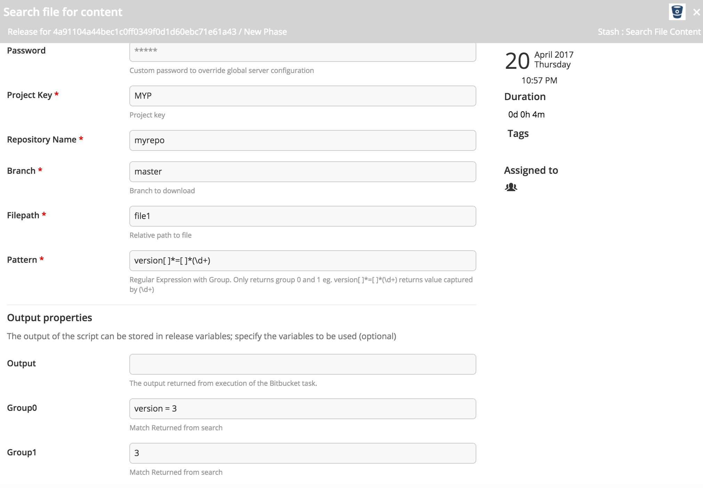

* Download Code
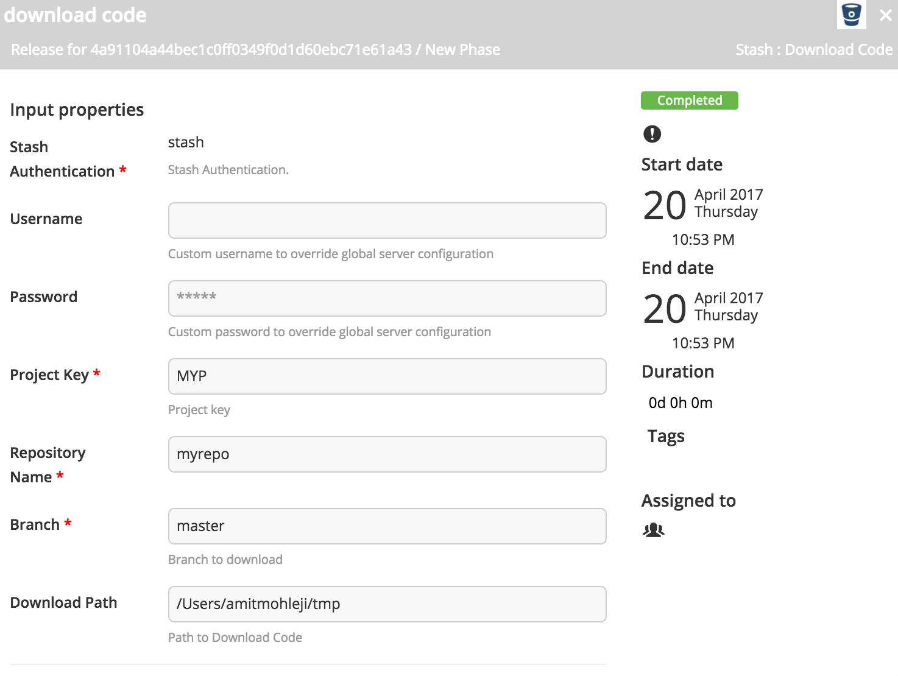

* Get Pull Request
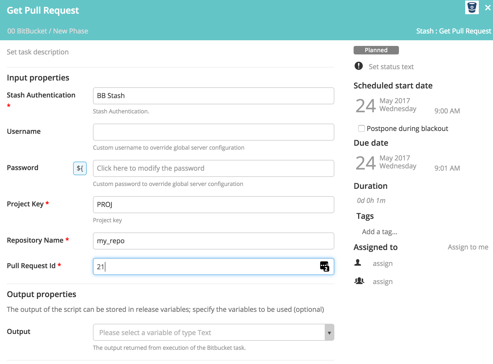

* Tag Release
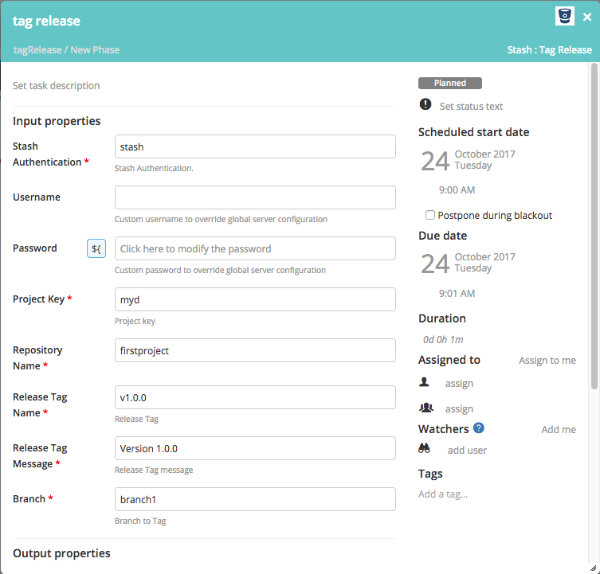

* Query Commits
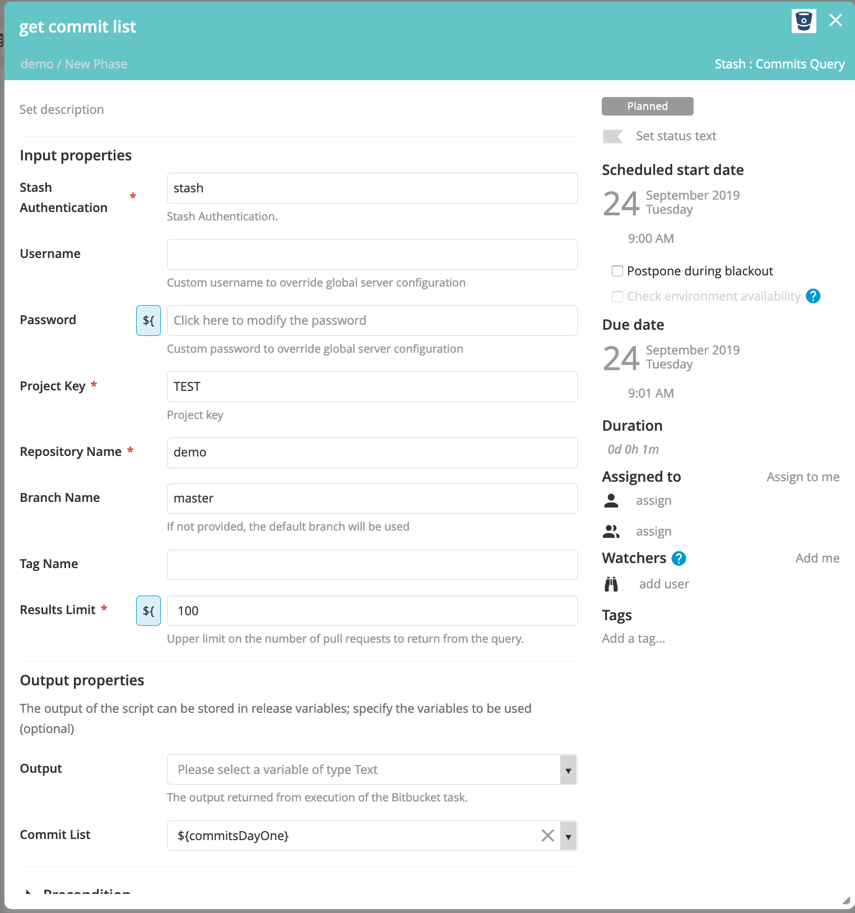

* Stash Dashboard
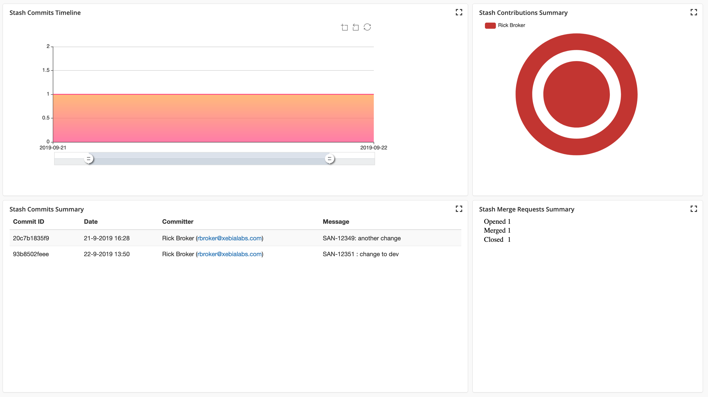

# References #

* [Stash/Xray Server REST API](https://developer.atlassian.com/stash/docs/latest/reference/rest-api.html)  
* [Xray Cloud REST API](https://confluence.atlassian.com/xray/use-the-xray-cloud-rest-apis-222724129.html)
