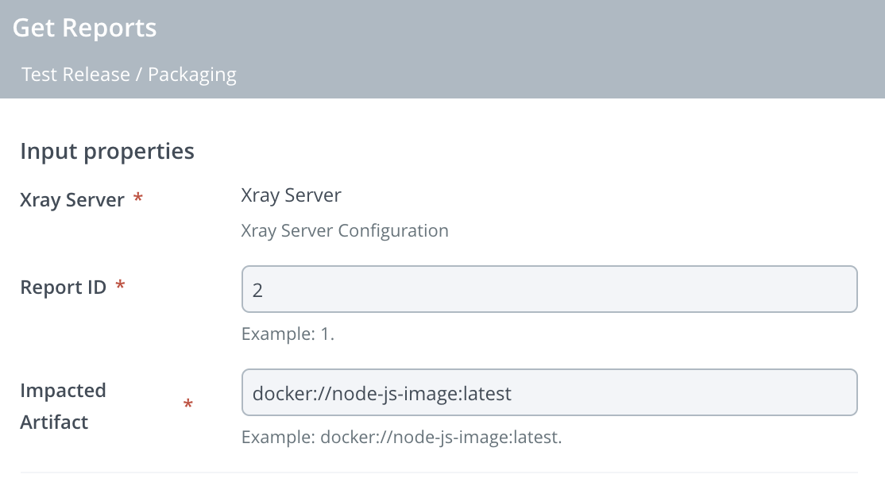

# Digital.ai Release Plugin - JFrog Xray

[![Build Status][xlr-xray-plugin-travis-image]][xlr-xray-plugin-travis-url]
[![Codacy Badge][xlr-xray-plugin-codacy-image] ][xlr-xray-plugin-codacy-url]
[![License: MIT][xlr-xray-plugin-license-image] ][xlr-xray-plugin-license-url]
[![Github All Releases][xlr-xray-plugin-downloads-image] ]()

This Plugin offers an interface from Digital.ai Release to JFrog Xray Server and Cloud API.

# Development #

* Start XLR: `./gradlew runDockerCompose`

# Type definitions #

### Get Vulnerabilities Report ###

+ `Xray.GetReports` : Getting a vulnerabilities report based on Report ID and artifact identifier.

* Stash Dashboard

# References #

* [JFrog Xray REST API](https://www.jfrog.com/confluence/display/JFROG/Xray+REST+API)
